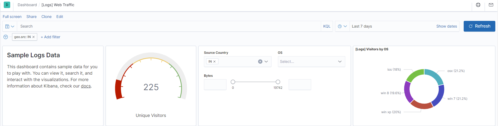

Exploring Kibana

Add the sample web log data to Kibana

Answer the following questions:

In the last 7 days, how many unique visitors were located in India?
225

In the last 24 hours, of the visitors from China, how many were using Mac OSX?
11

In the last 2 days, what percentage of visitors received 404 errors? How about 503 errors?
404 = 100%
503 = 0%

In the last 7 days, what country produced the majority of the traffic on the website?
18.9%

Of the traffic that's coming from that country, what time of day had the highest amount of activity?
40

List all the types of downloaded files that have been identified for the last 7 days, along with a short description of each file type (use Google if you aren't sure about a particular file type).
gz: gzip, compressed archive using an algorithm
css: programming language used for web pages
	
zip: compressed archive
deb: debian, linux compressed package
rpm: like deb, but used for red hat enterprises
Now that you have a feel for the data, Let's dive a bit deeper. Look at the chart that shows Unique Visitors Vs. Average Bytes.

Locate the time frame in the last 7 days with the most amount of bytes (activity).	9,002
In your own words, is there anything that seems potentially strange about this activity?	There appears to be 2 suspicious visitors
Filter the data by this event.

What is the timestamp for this event?	                                                  Feb 5, 2022 @ 20:36:56.687 & Feb 5, 2022 @ 19:00:00.000
What kind of file was downloaded?	Zip file
From what country did this activity originate?	Brazil and Algeria
What HTTP response codes were encountered by this visitor? 200
Switch to the Kibana Discover page to see more details about this activity.

What is the source IP address of this activity?                              19.112.190.54 & 17.111.163.53
What are the geo coordinates of this activity?                                             "lat": 40.88544444, "lon": -83.86863889 &                                           "lat": 42.59157139, "lon": -114.7967178
What OS was the source machine running? ios & win7
What is the full URL that was accessed? https://www.elastic.co/downloads/apm & https://artifacts.elastic.co/downloads/kibana/kibana-6.3.2-windows-x86_64.zip
From what website did the visitor's traffic originate? http://twitter.com/success/thomas-reiter & http://twitter.com/success/mark-kelly

Finish your investigation with a short overview of your insights.

What do you think the user was doing? One was downloading a apm file and the other was downloading a deb file
Was the file they downloaded malicious? If not, what is the file used for? Probably not, the apm file is a performance application and the other a debian application.
Is there anything that seems suspicious about this activity? Unless you can see the actual file then there’s no real way of telling unless it's from a legitimate and trusted source.
Is any of the traffic you inspected potentially outside of compliance guidelines? Nothing in particular stands out to me. Looks like normal use.
